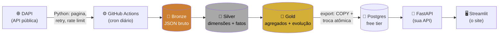

# 🦖 Digimon Lakehouse

> Um pipeline de dados **100% na nuvem, 100% gratuito**, construído em cima da [DAPI](https://digi-api.com) (a API pública de Digimon). Se você está aprendendo Databricks, este README é o seu Digivice: aponta o caminho, explica o *porquê* de cada passo, e — o mais importante — mostra os perrengues reais que a gente já apanhou por você, pra você não apanhar de novo.

Assim como um Digimon evolui de Baby pra Mega, os dados deste projeto evoluem de **Bronze** pra **Gold** — e no caminho você aprende Databricks, Spark, SQL avançado, APIs, CI/CD e deploy gratuito. É sério, é divertido, e no final você tem um projeto de portfólio de verdade, não um "hello world".

**TL;DR do que existe aqui:** um script Python busca todos os Digimons numa API pública → o Databricks organiza isso em três camadas (Bronze/Silver/Gold) → um Postgres gratuito serve como "cache rápido" → uma API FastAPI que você mesmo escreveu expõe os dados → um site em Streamlit consome essa API → o GitHub Actions orquestra tudo automaticamente, todo dia, de graça.

---

## 📖 Sumário

- [🎯 O que é isso, e por que Digimon](#-o-que-é-isso-e-por-que-digimon)
- [🗺️ Mapa do projeto](#️-mapa-do-projeto)
- [🎓 O que você vai aprender](#-o-que-você-vai-aprender)
- [🧰 Antes de começar](#-antes-de-começar)
- [🚀 Passo a passo](#-passo-a-passo)
- [🩹 Perrengues reais (erros que já apanhamos por você)](#-perrengues-reais-erros-que-já-apanhamos-por-você)
- [🔒 Segurança aplicada](#-segurança-aplicada)
- [⚡ Performance aplicada](#-performance-aplicada)
- [🎈 Limitações do tier gratuito](#-limitações-do-tier-gratuito)
- [🗓️ Roteiro de estudo](#️-roteiro-de-estudo)

---

## 🎯 O que é isso, e por que Digimon

Todo projeto de estudo de engenharia de dados precisa de um dataset. A maioria escolhe algo sério e meio sem graça (vendas de loja fictícia, clima de uma cidade qualquer). Este aqui usa **Digimon** — e não é só por diversão: a DAPI tem exatamente a complexidade certa pra ensinar coisas de verdade:

- Cada Digimon tem **níveis, tipos, atributos e campos** (dimensões clássicas de modelagem).
- Cada Digimon **evolui para outros Digimons** — uma relação de grafo bem mais densa do que parece (alguns nós com 188 conexões), ótima pra aprender na prática quando SQL recursivo resolve e quando você precisa trocar de estratégia.
- O dataset é pequeno (~1.400 digimons, ~15 mil arestas de evolução), então você foca em **aprender o padrão certo**, não em esperar jobs gigantes rodarem.

Ou seja: parece brincadeira, mas modela problemas reais de um jeito que você entende rapidinho o que está acontecendo.

## 🗺️ Mapa do projeto



Databricks faz a parte "pesada" (Bronze → Silver → Gold, o **medallion architecture** — o mesmo padrão que empresas de verdade usam). O GitHub Actions é o maestro: dispara a ingestão, espera o Databricks processar, e só então libera os dados pro Postgres — que existe só pra sua API responder rápido, sem depender de um Spark acordando do zero a cada request.

### Estrutura de pastas

```
ingestion/        → script Python: DAPI -> Bronze
databricks/
  notebooks/      → 00 setup, 01 silver, 02 gold
  databricks.yml, resources/  → Databricks Asset Bundle (o pipeline "como código")
scripts/          → export Gold -> Postgres, dispara+espera o job Databricks
api/              → sua API (FastAPI)
site/             → seu site (Streamlit)
.github/          → workflows (ci, ingest) + Dependabot
```

## 🎓 O que você vai aprender

| Tema | Onde você pratica |
|---|---|
| Fundamentos de Databricks (workspace, compute serverless, Delta Lake) | `databricks/notebooks/00_setup_schemas.py` |
| Ingestão resiliente de uma API externa (retry, backoff, idempotência) | `ingestion/` |
| Modelagem dimensional (dimensões, tabelas-ponte, fato) | `databricks/notebooks/01_silver_transform.py` |
| Grafos: quando `WITH RECURSIVE` funciona e quando programação dinâmica é a resposta certa | `databricks/notebooks/02_gold_aggregate.py` |
| Infra como código (Databricks Asset Bundles) | `databricks/databricks.yml` |
| Orquestração multi-serviço (GitHub Actions como maestro) | `.github/workflows/ingest.yml` |
| API assíncrona com segurança e performance de verdade | `api/` |
| Consumo de API num app de dados (Streamlit) | `site/` |

## 🧰 Antes de começar

Você vai precisar de contas (todas com tier gratuito):

| Serviço | Pra quê | Cartão de crédito? |
|---|---|---|
| [Databricks](https://www.databricks.com/try-databricks) (Free Edition) | processar Bronze/Silver/Gold | Não |
| [GitHub](https://github.com) | versionar código + orquestrar (Actions) | Não |
| [Neon](https://neon.tech) ou [Supabase](https://supabase.com) | Postgres gratuito, sempre ativo | Não |
| [Render](https://render.com) (ou Fly.io / Hugging Face Spaces) | hospedar sua API | Não |
| [Streamlit Community Cloud](https://streamlit.io/cloud) | hospedar seu site | Não |

E localmente: **Python 3.12+** e a **Databricks CLI** (instalamos ela junto, calma).

> 💡 **Dica de quem já apanhou**: se você acabou de instalar Python, Git ou a Databricks CLI e o terminal diz "comando não encontrado", **abra uma janela nova do terminal**. O PATH só atualiza em sessões novas — foi exatamente isso que nos travou umas 3 vezes durante a construção deste projeto.

## 🚀 Passo a passo

### Passo 1 — Instalar e autenticar a Databricks CLI

```bash
# NÃO use `pip install databricks-cli` — é a versão antiga, sem suporte a
# `bundle`. A certa é distribuída como binário:
winget install Databricks.DatabricksCLI          # Windows
# curl -fsSL https://raw.githubusercontent.com/databricks/setup-cli/main/install.sh | sh   # macOS/Linux

databricks auth login --host <seu-workspace>
```

Isso abre o navegador pra você logar — **sem PAT, sem copiar/colar token**. Se aparecer uma mensagem sobre `databricks aitools install` (um plugin de skills pra agentes de código tipo Claude Code/Cursor), ela é opcional: dá pra rodar `databricks aitools install --scope project` se você usa um desses, ou simplesmente ignorar e seguir — não é obrigatório pro pipeline funcionar.

**Checkpoint:** `databricks auth profiles` deve listar seu workspace com `Valid = YES`.

### Passo 2 — Entender o compute (a pegadinha do Free Edition)

Antes de sair criando cluster, saiba disto: **Databricks Free Edition não tem cluster clássico** — é **serverless only**. Se você tentar `databricks clusters create`, vai levar um:

```
Error: Current organization ... does not have any associated worker environments
```

Isso é esperado, não é erro seu. A boa notícia: **você não precisa criar nada** — o job do pipeline já está configurado pra rodar em compute serverless automaticamente (sem `existing_cluster_id`, sem gerenciar cluster ocioso, sem custo de compute parado).

O que você **já tem** por padrão: Compute > SQL Warehouses > um **Serverless Starter Warehouse**. Copie o **HTTP Path** dele (Connection details) — vai usar no passo 4.

### Passo 3 — Deploy do pipeline (Databricks Asset Bundle)

Um "Asset Bundle" é a forma do Databricks de dizer "meu pipeline inteiro é um arquivo YAML versionado", em vez de cliques espalhados na UI que ninguém lembra depois. Você define os notebooks e o job em `databricks/databricks.yml` + `databricks/resources/jobs.yml`, e faz:

```bash
cd databricks
databricks bundle validate   # confere se o YAML faz sentido, sem mexer em nada
databricks bundle deploy -t dev   # sobe os notebooks + cria o job de verdade
```

**Checkpoint:** `Deployment complete!`. Se der erro de `path ... is not contained in sync root path`, é porque algum notebook está fora da árvore de pastas do `databricks.yml` — no nosso caso isso já está resolvido (`notebooks/` é irmão de `databricks.yml`, não primo distante).

Pra pegar o **Job ID** gerado (vai precisar dele no passo 7):

```bash
databricks jobs list --output json | grep -B2 -A2 digimon_transform_pipeline
```

### Passo 4 — Gerar o PAT e rodar a ingestão (Bronze)

O login OAuth do passo 1 autentica a **CLI** (bundle, jobs). Mas os scripts Python (`ingestion/`, `scripts/`) usam a lib `databricks-sql-connector`, que fala com o SQL Warehouse via **token** — daí precisar de um Personal Access Token (PAT) só pra essa parte.

1. No workspace: **User Settings > Developer > Access Tokens > Generate new token**.
2. **Tempo de vida**: 90 dias (não deixe no padrão curto — o pipeline roda todo dia via GitHub Actions, um token que expira em 3 dias quebra tudo sozinho).
3. **Escopo**: marque só **`sql`**. Nada de `jobs`, `workspace`, `unity-catalog` ou "todas as APIs" — o token só vai rodar `SELECT`/`MERGE INTO` contra o warehouse, então é só disso que ele precisa (mesmo princípio de menor privilégio que usamos no Postgres mais adiante).

Copie `.env.example` para `.env` e preencha:

```bash
DATABRICKS_HOST=https://<seu-workspace>.cloud.databricks.com
DATABRICKS_TOKEN=<o token que você acabou de gerar>
DATABRICKS_HTTP_PATH=/sql/1.0/warehouses/<id-do-warehouse-do-passo-2>
DATABRICKS_CATALOG=digimon_lakehouse
DATABRICKS_SCHEMA_BRONZE=bronze
```

Agora rode a ingestão de verdade:

```bash
cd ingestion
pip install -r requirements.txt
python extract_digimon.py
```

Isso pagina a DAPI inteira (com retry, backoff e um rate limit de 0.3s entre chamadas — não é falta de pressa, é não sobrecarregar uma API pública gratuita de terceiros) e grava tudo na tabela `bronze.raw_digimon` via `MERGE` idempotente. Leva alguns minutos — é normal.

**Checkpoint:** o log termina com `Ingestão concluída: N processados, 0 falhas`.

### Passo 5 — Rodar o job (Silver → Gold)

```bash
databricks jobs run-now <job-id-do-passo-3>
```

O job roda três notebooks em sequência: `00_setup_schemas` (cria catalog/schemas), `01_silver_transform` (normaliza em dimensões/fatos) e `02_gold_aggregate` (agrega + resolve a cadeia de evolução mais longa por digimon via programação dinâmica — ver "Perrengues reais" abaixo pra entender por que não é `WITH RECURSIVE`).

**Checkpoint:** `databricks jobs get-run <run-id> --output json` mostra as três tasks com `result_state: SUCCESS`.

### Passo 6 — Postgres: sua camada de serving

Crie um projeto gratuito no [Neon](https://neon.tech) ou [Supabase](https://supabase.com) e rode isto como owner do banco:

```sql
CREATE ROLE writer_user LOGIN PASSWORD 'defina-uma-senha-forte';
CREATE ROLE reader_user LOGIN PASSWORD 'defina-outra-senha-forte';

GRANT CREATE, USAGE ON SCHEMA public TO writer_user;
GRANT CONNECT ON DATABASE <seu_banco> TO reader_user;
GRANT USAGE ON SCHEMA public TO reader_user;
GRANT SELECT ON ALL TABLES IN SCHEMA public TO reader_user;
```

```sql
-- Conecte COMO writer_user e rode isto — sem isso, reader_user perde o
-- SELECT toda vez que uma tabela é recriada (o export usa staging+rename):
ALTER DEFAULT PRIVILEGES IN SCHEMA public GRANT SELECT ON TABLES TO reader_user;
```

Por que dois usuários? Porque a API **nunca** deveria ter permissão de escrita — se um dia tiver um bug nela, o pior caso é alguém conseguir *ler* dados públicos de Digimon, não apagar sua tabela.

Rode o export uma vez pra testar:

```bash
cd scripts
pip install -r requirements.txt
# adicione PG_WRITER_DSN ao seu .env antes de rodar
python export_gold_to_postgres.py
```

### Passo 7 — GitHub Secrets (automatizando tudo)

Settings > Secrets and variables > Actions, no seu repositório:

| Secret | Valor |
|---|---|
| `DATABRICKS_HOST` | do passo 1 |
| `DATABRICKS_TOKEN` | do passo 4 |
| `DATABRICKS_HTTP_PATH` | do passo 2 |
| `DATABRICKS_JOB_ID` | do passo 3 |
| `PG_WRITER_DSN` | do passo 6 |

A partir daqui, `.github/workflows/ingest.yml` roda **sozinho todo dia**: ingestão → job Databricks → export pro Postgres, nessa ordem, sem você tocar em nada.

### Passo 8 — Sua API no ar (Render)

New Web Service no [Render](https://render.com) > conecte este repo > **Root Directory**: `digimon-lakehouse/api` > runtime **Docker**. Configure `PG_READER_DSN`, `API_CORS_ORIGINS` e `API_RATE_LIMIT_PER_MINUTE` nas env vars do serviço. Deploy automático a cada push — o Render já faz isso, sem workflow extra.

**Checkpoint:** `https://sua-api.onrender.com/healthz` responde `{"status": "ok"}`. E `/docs` mostra o Swagger da sua própria API — mostra isso pros amigos, é um momento de orgulho legítimo.

### Passo 9 — Seu site no ar (Streamlit)

New app no [Streamlit Community Cloud](https://streamlit.io/cloud) > conecte o repo > **Main file path**: `site/streamlit_app.py`. Em *Secrets*, adicione `SITE_API_BASE_URL = "https://sua-api.onrender.com"`.

**Checkpoint:** o site abre, lista Digimons, e os gráficos de "distribuição por nível/tipo/atributo" aparecem preenchidos.

### Passo 10 — Rodando tudo localmente (dev loop)

```bash
cp .env.example .env   # preencha com os valores reais

cd ingestion  && pip install -r requirements.txt && python extract_digimon.py
cd ../scripts && pip install -r requirements.txt && python export_gold_to_postgres.py
cd ../api      && pip install -r requirements-dev.txt && uvicorn app.main:app --reload
cd ../site     && pip install -r requirements.txt && streamlit run streamlit_app.py
```

## 🩹 Perrengues reais (erros que já apanhamos por você)

Tudo abaixo aconteceu de verdade construindo este projeto — deixamos documentado pra você reconhecer na hora, em vez de passar 40 minutos googlando.

<details>
<summary><strong>❌ <code>[NOT_SUPPORTED_WITH_SERVERLESS] PERSIST TABLE is not supported</code></summary>

Compute serverless não suporta `.cache()`/`.persist()` de DataFrame. Se você adicionar isso em algum notebook achando que vai "otimizar", vai quebrar o job inteiro. Para um dataset deste tamanho (~1.400 digimons), não faz falta mesmo — o notebook `01_silver_transform.py` já vem sem.
</details>

<details>
<summary><strong>❌ <code>[INVALID_TEMP_OBJ_REFERENCE]</code> ao criar uma VIEW</strong></summary>

Uma **view persistente** não pode referenciar uma **temp view** da mesma sessão (`createOrReplaceTempView`) — a view persistente sobrevive à sessão, a temp view não, então o Spark recusa de cara. Se o seu objeto só existe pra checagem/leitura dentro do mesmo notebook, use `CREATE OR REPLACE TABLE` em vez de `VIEW` — é o que `silver.dq_evolution_inconsistencies` faz aqui.
</details>

<details>
<summary><strong>❌ <code>[RECURSION_ROW_LIMIT_EXCEEDED]</code> num <code>WITH RECURSIVE</code></strong></summary>

A tentação de resolver "cadeia de evolução" com CTE recursiva parece óbvia — e quebra em dado real. A DAPI agrega evoluções de vários jogos/mídias no mesmo grafo, então alguns digimons têm **até 188 arestas de saída**. Enumerar todo caminho possível explode combinatorialmente bem antes de qualquer ciclo (travar a profundidade não resolve — o problema é largura, não altura). A saída foi trocar de "enumerar caminhos" pra "programação dinâmica com memoização" em Python (ver `02_gold_aggregate.py`) — calcula uma vez por nó, não uma vez por caminho.
</details>

<details>
<summary><strong>🌀 O job termina sem erro, mas nunca... termina</strong></summary>

Pior que um erro é um job que fica `RUNNING` para sempre e você não sabe por quê. Aconteceu aqui: a versão em DP tinha um bug sutil — o ponteiro "melhor próximo nó" de dois digimons podia formar um ciclo entre si (`A` aponta pra `B`, `B` aponta de volta pra `A`), e reconstruir o caminho seguindo esses ponteiros entrava num loop infinito. O valor numérico calculado estava certo; só o passeio final pra montar a lista é que travava. Fix: manter um `visited` durante a reconstrução do caminho e parar assim que um nó repetir, em vez de confiar cegamente nos ponteiros.
</details>

<details>
<summary><strong>🔍 O pipeline rodou "certinho" e o resultado não fazia sentido</strong></summary>

A primeira versão corrigida do cálculo de evolução reportou uma cadeia de **142 estágios**. Sem erro nenhum — e completamente errado (Digimon real vai de Baby a Mega em uns 6-7 estágios). O bug não estava em travar ou não travar, estava em seguir **qualquer** aresta do grafo denso como se fosse progressão real. A correção foi usar o nível (`Baby I → Baby II → Child → ...`, que já estava certo em `silver.dim_level`) pra só contar uma aresta como "evolução" quando o destino é de um estágio genuinamente mais avançado. **Lição**: job verde não é sinônimo de resultado certo — depois que roda sem erro, ainda vale olhar se o número faz sentido.
</details>

<details>
<summary><strong>❌ <code>does not have any associated worker environments</code></summary>

Você tentou criar um cluster clássico. Free Edition é serverless-only — não cria cluster, usa o warehouse serverless que já vem por padrão (ver Passo 2).
</details>

<details>
<summary><strong>❌ <code>path ... is not contained in sync root path</code> no <code>bundle validate</code></summary>

Um Databricks Asset Bundle só sincroniza arquivos que estão **dentro** (ou abaixo) da pasta onde mora o `databricks.yml`. Se seus notebooks estiverem numa pasta irmã (não filha), o bundle não enxerga. Solução: notebooks e `databricks.yml`/`resources/` precisam compartilhar a mesma raiz.
</details>

<details>
<summary><strong>⚠️ CLI pede pra rodar <code>databricks aitools install</code></summary>

É uma feature real (não é golpe/injeção — a gente checou `--help` antes de rodar qualquer coisa): instala skills de Databricks pro seu agente de código. É opcional; se rodar, prefira `--scope project` em vez do padrão global, pra não afetar outros projetos seus sem querer.
</details>

<details>
<summary><strong>⚠️ <code>psycopg</code>/<code>databricks-sql-connector</code> não instalam em Python novo</strong></summary>

Se você estiver numa versão de Python bem recente, pode encontrar erro de build (ex.: `numpy` tentando compilar do zero, sem compilador C disponível). A causa costuma ser uma versão antiga fixada no `requirements.txt` sem wheel pronta pra essa versão de Python — o fix é atualizar o pacote pra uma versão mais recente (o que já está feito aqui, mas fica registrado o porquê).
</details>

<details>
<summary><strong>⚠️ PAT com escopo obrigatório e você não sabe qual marcar</strong></summary>

Marque só **`sql`**. É o único escopo que o `databricks-sql-connector` usa neste projeto (roda `SELECT`/`MERGE` contra o SQL Warehouse) — qualquer coisa a mais é privilégio que o token nunca vai precisar exercer.
</details>

## 🔒 Segurança aplicada

- Segredos só via `.env`/GitHub Secrets — nunca hardcoded (`.env` no `.gitignore`, `.env.example` só com placeholders).
- PAT do Databricks com **escopo `sql`** e expiração de 90 dias, não "todas as APIs".
- Postgres com dois usuários (writer/reader) — a API nunca tem permissão de escrita.
- Todo SQL usa bind de parâmetros (ingestão, export, API) — nenhuma f-string com valor de usuário vira texto SQL.
- API: CORS restrito a origens explícitas, rate limit por IP, validação de input (regex nos filtros, teto de paginação), handler de exceção que nunca vaza stack trace, headers de segurança.
- Docker da API roda como usuário não-root, imagem multi-stage enxuta.
- GitHub Actions: `permissions: contents: read` mínimo, secrets nunca expostos a `pull_request` de fork.
- Dependabot (`pip`, `docker`, `github-actions`) atualizando dependências vulneráveis automaticamente.

## ⚡ Performance aplicada

- Ingestão: sessão HTTP reaproveitada, retry com backoff exponencial só em erro transitório, rate limit pra não sobrecarregar a API pública, timeout em toda chamada.
- Bronze: `MERGE` em lote (staging + upsert) em vez de linha a linha.
- API: pool de conexões assíncrono pequeno (calibrado pro limite do Postgres free-tier), cache TTL em memória, GZip nas respostas, paginação com teto.
- Export Gold→Postgres: `COPY` binário em vez de `INSERT` linha a linha, troca atômica (staging+rename) — a API nunca vê tabela pela metade.
- Site: `st.cache_data` em toda chamada à API, evitando refetch a cada interação.

## 🎈 Limitações do tier gratuito

- Databricks Free Edition: serverless only, sem cache de DataFrame (ver Perrengues acima).
- Render/Fly/Streamlit Cloud free: "dormem" após inatividade — primeira request depois disso é mais lenta (cold start), comportamento esperado.
- Postgres free (Neon/Supabase): limite de conexões simultâneas — por isso o pool da API é pequeno de propósito.

## 🗓️ Roteiro de estudo

- [ ] Fundamentos Databricks (compute serverless, notebooks, Delta Lake)
- [ ] Ingestão (paginação, idempotência, resiliência a falhas de API externa)
- [ ] Modelagem silver (schema explícito, qualidade de dados)
- [ ] Modelagem gold (agregações, grafos/hierarquias — e quando trocar `WITH RECURSIVE` por DP)
- [ ] Orquestração (Databricks Jobs + GitHub Actions, Asset Bundles como IaC)
- [ ] API própria (segurança, performance, deploy)
- [ ] Site consumindo a API própria
- [ ] Observabilidade básica (logs estruturados, status de pipeline)

---

*Dados via [DAPI](https://digi-api.com) (CC-BY-SA), não afiliado à Bandai. Projeto de estudo — sinta-se livre pra clonar, quebrar e reconstruir.*
