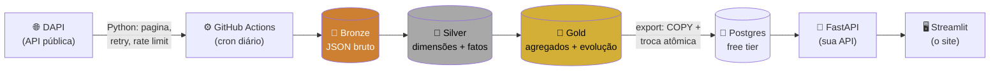

# 🦖 Digimon Lakehouse

> Um pipeline de dados **100% na nuvem, 100% gratuito**, construído em cima da [DAPI](https://digi-api.com) (a API pública de Digimon).

Assim como um Digimon evolui de Baby pra Mega, os dados deste projeto evoluem de **Bronze** pra **Gold** — e no caminho você aprende Databricks, Spark, SQL avançado, APIs, CI/CD e deploy gratuito. É sério, é divertido, e no final você tem um projeto de portfólio de verdade, não um "hello world".

**TL;DR do que existe aqui:** um script Python busca todos os Digimons numa API pública → o Databricks organiza isso em três camadas (Bronze/Silver/Gold) → um Postgres gratuito serve como "cache rápido" → uma API FastAPI que você mesmo escreveu expõe os dados → um site em Streamlit consome essa API → o GitHub Actions orquestra tudo automaticamente, todo dia, de graça.

|  |  |
|---|---|
| 🚀 **Quer rodar isso na sua conta?** | Passo a passo completo em [SETUP.md](SETUP.md) |
| 🎓 **Já rodou e quer praticar?** | Exercícios validados em [GUIA_DATABRICKS.md](GUIA_DATABRICKS.md) |

---

## 📖 Sumário

- [🎯 O que é isso, e por que Digimon](#-o-que-é-isso-e-por-que-digimon)
- [🗺️ Mapa do projeto](#️-mapa-do-projeto)
- [🧱 Stack por camada](#-stack-por-camada)
- [🔒 Segurança aplicada](#-segurança-aplicada)
- [⚡ Performance aplicada](#-performance-aplicada)
- [🎈 Limitações do tier gratuito](#-limitações-do-tier-gratuito)
- [🩹 Problemas conhecidos](#-problemas-conhecidos)
- [🗓️ Roteiro de estudo](#️-roteiro-de-estudo)

---

## 🎯 O que é isso, e por que Digimon

Todo projeto de estudo de engenharia de dados precisa de um dataset. A maioria escolhe algo sério e meio sem graça (vendas de loja fictícia, clima de uma cidade qualquer). Este aqui usa **Digimon** — e não é só por diversão: a DAPI tem exatamente a complexidade certa pra ensinar coisas de verdade:

- Cada Digimon tem **níveis, tipos, atributos e campos** (dimensões clássicas de modelagem).
- Cada Digimon **evolui para outros Digimons** — uma relação de grafo bem mais densa do que parece (alguns nós com 188 conexões), ótima pra aprender na prática quando SQL recursivo resolve e quando você precisa trocar de estratégia.
- O dataset é pequeno (~1.400 digimons, ~15 mil arestas de evolução), então você foca em **aprender o padrão certo**, não em esperar jobs gigantes rodarem.

Ou seja: parece brincadeira, mas modela problemas reais de um jeito que você entende rapidinho o que está acontecendo.

## 🗺️ Mapa do projeto



Databricks faz a parte "pesada" (Bronze → Silver → Gold, o **medallion architecture** — o mesmo padrão que empresas de verdade usam). O GitHub Actions é o maestro: dispara a ingestão, espera o Databricks processar, e só então libera os dados pro Postgres — que existe só pra sua API responder rápido, sem depender de um Spark acordando do zero a cada request.

### Estrutura de pastas

```
ingestion/        → script Python: DAPI -> Bronze
databricks/
  notebooks/      → 00 setup, 01 silver, 02 gold
  databricks.yml, resources/  → Databricks Asset Bundle (o pipeline "como código")
scripts/          → export Gold -> Postgres, dispara+espera o job Databricks
api/              → sua API (FastAPI)
site/             → seu site (Streamlit)
.github/          → workflows (ci, ingest) + Dependabot
```

## 🧱 Stack por camada

| Camada | Tecnologia | Por quê / onde ver |
|---|---|---|
| Ingestão | Python + `requests` | retry/backoff, idempotência — `ingestion/` |
| Lakehouse | Databricks (serverless) + Delta Lake | medallion architecture — `databricks/notebooks/` |
| Modelagem | SQL + PySpark | dimensões, grafos, programação dinâmica — `02_gold_aggregate.py` |
| Infra do pipeline | Databricks Asset Bundles | notebooks + job como código — `databricks/databricks.yml` |
| Orquestração | GitHub Actions | cron diário, secrets — `.github/workflows/ingest.yml` |
| Serving | Postgres (Neon/Supabase) | camada rápida pra API não depender de cold start do Spark |
| API | FastAPI (async) | segurança e performance de verdade — `api/` |
| Site | Streamlit | consumo da própria API — `site/` |

## 🔒 Segurança aplicada

- Segredos só via `.env`/GitHub Secrets — nunca hardcoded (`.env` no `.gitignore`, `.env.example` só com placeholders).
- PAT do Databricks com **escopo `sql`** e expiração de 90 dias, não "todas as APIs".
- Postgres com dois usuários (writer/reader) — a API nunca tem permissão de escrita.
- Todo SQL usa bind de parâmetros (ingestão, export, API) — nenhuma f-string com valor de usuário vira texto SQL.
- API: CORS restrito a origens explícitas, rate limit por IP, validação de input (regex nos filtros, teto de paginação), handler de exceção que nunca vaza stack trace, headers de segurança.
- Docker da API roda como usuário não-root, imagem multi-stage enxuta.
- GitHub Actions: `permissions: contents: read` mínimo, secrets nunca expostos a `pull_request` de fork.
- Dependabot (`pip`, `docker`, `github-actions`) atualizando dependências vulneráveis automaticamente.

## ⚡ Performance aplicada

- Ingestão: sessão HTTP reaproveitada, retry com backoff exponencial só em erro transitório, rate limit pra não sobrecarregar a API pública, timeout em toda chamada.
- Bronze: `MERGE` em lote (staging + upsert) em vez de linha a linha.
- API: pool de conexões assíncrono pequeno (calibrado pro limite do Postgres free-tier), cache TTL em memória, GZip nas respostas, paginação com teto.
- Export Gold→Postgres: `COPY` binário em vez de `INSERT` linha a linha, troca atômica (staging+rename) — a API nunca vê tabela pela metade.
- Site: `st.cache_data` em toda chamada à API, evitando refetch a cada interação.

## 🎈 Limitações do tier gratuito

- Databricks Free Edition: serverless only, sem cache de DataFrame.
- Render/Fly/Streamlit Cloud free: "dormem" após inatividade — primeira request depois disso é mais lenta (cold start), comportamento esperado.
- Postgres free (Neon/Supabase): limite de conexões simultâneas — por isso o pool da API é pequeno de propósito.

## 🩹 Problemas conhecidos

Coisas reais que quebraram construindo este projeto — a explicação completa de cada uma (com o erro exato e o porquê) está em [SETUP.md](SETUP.md#perrengues-reais-erros-que-já-apanhamos-por-você):

- Compute serverless não suporta `.cache()`/`.persist()` de DataFrame.
- `WITH RECURSIVE` explode em grafos densos — a cadeia de evolução usa programação dinâmica em Python em vez disso.
- Free Edition não tem cluster clássico (é serverless-only) — o job já vem configurado pra isso.
- Streamlit Cloud pode escolher uma versão de Python muito nova por padrão e quebrar o `altair` — fixamos em 3.12 via `site/runtime.txt`, mas às vezes precisa ajustar manualmente nas Settings do app.

## 🗓️ Roteiro de estudo

- [ ] Fundamentos Databricks (compute serverless, notebooks, Delta Lake)
- [ ] Ingestão (paginação, idempotência, resiliência a falhas de API externa)
- [ ] Modelagem silver (schema explícito, qualidade de dados)
- [ ] Modelagem gold (agregações, grafos/hierarquias — e quando trocar `WITH RECURSIVE` por DP)
- [ ] Orquestração (Databricks Jobs + GitHub Actions, Asset Bundles como IaC)
- [ ] API própria (segurança, performance, deploy)
- [ ] Site consumindo a API própria
- [ ] Observabilidade básica (logs estruturados, status de pipeline)

---

*Dados via [DAPI](https://digi-api.com) (CC-BY-SA), não afiliado à Bandai. Projeto de estudo — sinta-se livre pra clonar, quebrar e reconstruir.*
